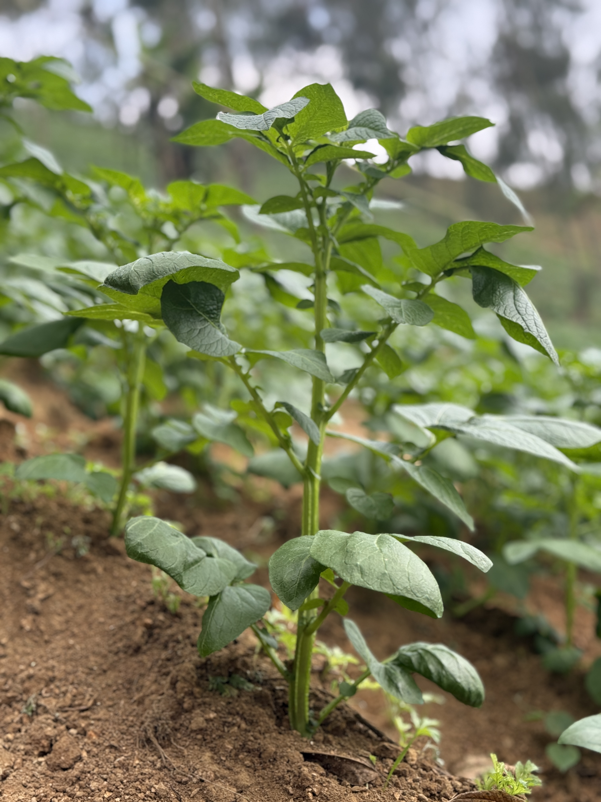

# 🌱 Bloomfield — Export-Ready Agriculture from Indonesia



Bloomfield connects Indonesia’s rich agricultural heritage to **global markets**.  
This repository contains the official **corporate website** for Bloomfield, built with:

- ⚡ HTML5 + CSS3 (modern dark theme)
- 🎨 Custom UI with responsive design
- 🌌 Interactive background using [Three.js](https://threejs.org/)
- 📱 Mobile-first layouts
- 📦 Product showcase (Potatoes, Patchouli Oil, Banana Leaves)
- 📩 Contact form with sales inquiry support


## 🚀 Features
- Hero section with animated background (particles & floating leaves)
- Products showcase with cards
- About Bloomfield company profile
- Video section with farm footage
- Export & logistics information
- Contact sales form + company info
- Responsive layout for desktop, tablet, and mobile


## 🛠️ Setup & Development
Clone this repo:
```bash
git clone https://github.com/dwikygilang/bloomfield-site.git
cd bloomfield-site
```

Run locally using any static server, e.g.:
```bash
npx http-server -p 8081
```

Then open:
```bash
http://localhost:8081
```
